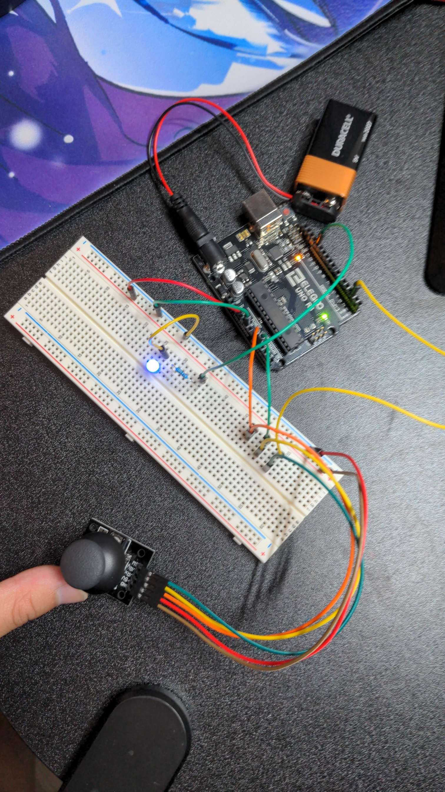
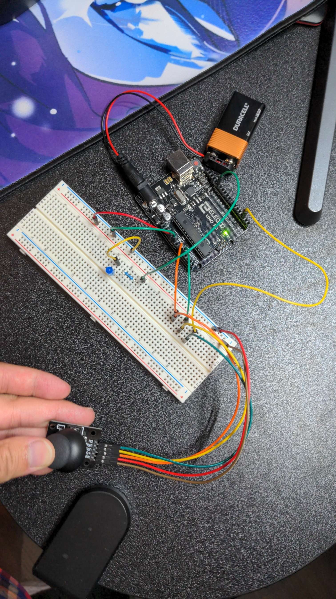

# Joystick

This is a small project that I made using an Arduino Uno with a Joystick module. This projects turns on the led light if the joystick is in the neutral position. But if it begins to move, the led will then be turned off.

Here are a few examples:
## On 

## Off 
